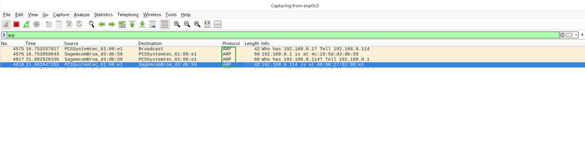

# Exercício 3 – Análise do protocolo ARP no Wireshark

## Objetivo

Capturar e analisar o funcionamento do protocolo ARP (Address Resolution Protocol), responsável por descobrir o endereço MAC associado a um endereço IPv4 na rede local.

## Ambiente

- VM Debian (192.168.0.114)
- Interface de rede: enp0s3
- Gateway: 192.168.0.1
- Wireshark para captura dos pacotes

## Comandos executados

Consultar a tabela de vizinhos ARP:

`ip neigh`

Limpar as entradas dinâmicas da interface de rede:

`sudo ip neigh flush dev enp0s3`

Gerar comunicação com o gateway:

`ping -c 4 192.168.0.1`

Consultar novamente a tabela:

`ip neigh show dev enp0s3`

No Wireshark, foi utilizado o filtro:

`arp`

## Análise da captura

**1. ARP Request**

A VM 192.168.0.114 enviou uma requisição ARP em broadcast perguntando quem possuía o endereço IP 192.168.0.1.

**2. ARP Reply**

O gateway 192.168.0.1 respondeu informando seu endereço MAC: 4c:19:5d:d3:db:59.

### Captura dos pacotes ARP no Wireshark

**3. Atualização da tabela ARP**

Após a comunicação, foi possível verificar que o Linux possuía novamente a associação entre o IP 192.168.0.1 e o endereço MAC do gateway na interface enp0s3.

Também foi observada uma requisição ARP unicast enviada pelo gateway à VM, demonstrando que nem toda requisição ARP precisa ser broadcast.

## Conclusão

O laboratório demonstrou como o protocolo ARP permite descobrir endereços MAC a partir de endereços IPv4 dentro da rede local.

Foi possível observar os pacotes ARP Request e ARP Reply no Wireshark e confirmar a associação IP/MAC na tabela de vizinhos do Linux.

Também foi observado que a tabela de vizinhos pode ser atualizada automaticamente, mesmo sem a execução manual de um comando ping.

Esse conhecimento é importante para análise de tráfego de rede e investigação de possíveis ataques de ARP Spoofing em ambientes de segurança da informação.