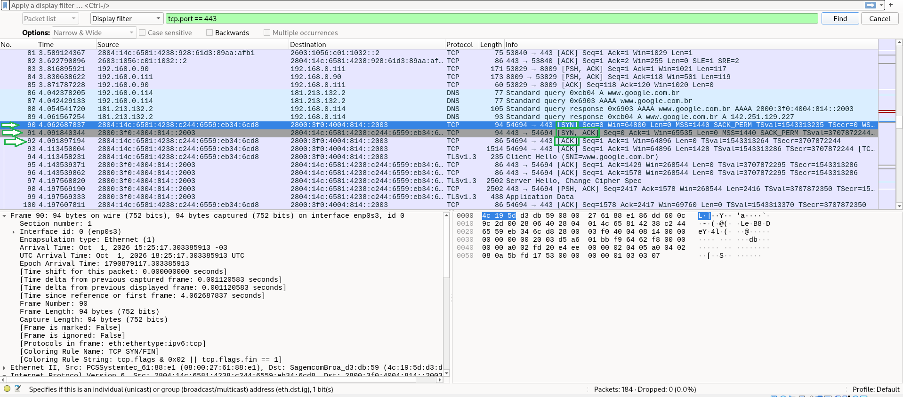

# Exercício 1 – Three-way handshake TCP no Wireshark

## Objetivo
Capturar e analisar o processo de abertura de uma conexão TCP
(three-way handshake) gerado por uma requisição HTTPS.

## Ambiente
- VM Debian (cliente)
- Wireshark para captura
- Comando executado na VM:

    curl -v https://www.google.com

- Filtro aplicado no Wireshark: `tcp.port == 443`

## Captura

## Análise

O TCP é um protocolo orientado à conexão: antes de trocar dados,
cliente e servidor sincronizam seus números de sequência em três etapas.

| Frame | Direção | Flags | O que acontece |
|-------|---------|-------|----------------|
| 90 | Cliente → Servidor | SYN | O cliente pede a abertura da conexão, saindo da porta efêmera 54694 para a porta 443 (HTTPS), com Seq=0. |
| 91 | Servidor → Cliente | SYN, ACK | O servidor confirma o SYN do cliente (Ack=1) e envia o próprio SYN (Seq=0). |
| 92 | Cliente → Servidor | ACK | O cliente confirma o SYN do servidor (Ack=1). A conexão está estabelecida. |

O Ack=1 aparece porque o SYN consome um número de sequência,
mesmo sem carregar dados. Os números mostrados são relativos;
os reais são aleatórios.

Logo após o handshake, o frame 93 traz o primeiro segmento com
dados (Len=1428): o início do Client Hello do TLS.

## Observações
- A conexão usou IPv6, pois cliente e servidor tinham endereço IPv6.
- MSS=1440: 1500 (MTU) − 40 (cabeçalho IPv6) − 20 (cabeçalho TCP).
- RTT do handshake: cerca de 29 ms (diferença entre os frames 90 e 91).
- Em uma primeira captura, feita via SSH, apareceram pacotes da
  própria sessão SSH (porta 22) misturados à análise. Rodar o curl
  direto na VM gerou uma captura limpa.