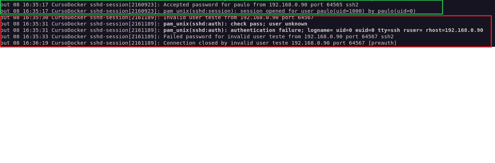

# Exercício 2 – Análise de autenticação SSH nos logs do Linux

## Objetivo
Analisar os registros de autenticação SSH no Linux, identificando tentativas de acesso bem-sucedidas e malsucedidas.

## Ambiente
- VM Debian (servidor SSH): `192.168.0.114`
- Máquina Windows com MobaXterm (cliente SSH): `192.168.0.90`
- Protocolo SSH (porta TCP 22)
- Comando executado na VM:

  `sudo journalctl -u ssh -n 30`

## Captura

## Análise

Foram realizadas duas tentativas de conexão SSH a partir da máquina `192.168.0.90`.

**1. Autenticação bem-sucedida**

O servidor SSH recebeu uma conexão do endereço IP `192.168.0.90`, utilizando a porta de origem `64565`, com destino à porta `22`.

O usuário `paulo` informou as credenciais corretas, e o Linux registrou as mensagens `Accepted password` e `session opened`, confirmando que a autenticação foi realizada com sucesso e a sessão foi aberta.

**2. Autenticação malsucedida**

Foi realizada outra tentativa de conexão a partir do mesmo endereço IP, utilizando a porta de origem `64567`.

Dessa vez, foi informado o usuário `teste`, que não existe no sistema, e uma senha incorreta.

O Linux registrou as mensagens `Invalid user`, `authentication failure` e `Failed password`, indicando que a tentativa de autenticação foi rejeitada.

## Observações
- O SSH utiliza, por padrão, a porta TCP 22.
- As portas `64565` e `64567` são portas efêmeras utilizadas pelo cliente.
- O comando `journalctl` permite consultar os registros do serviço SSH.
- Os logs de autenticação ajudam a identificar acessos autorizados e tentativas de acesso malsucedidas.
- Na área de Segurança Defensiva (SOC), esses registros podem ser utilizados para investigar atividades suspeitas e possíveis tentativas de acesso não autorizado.